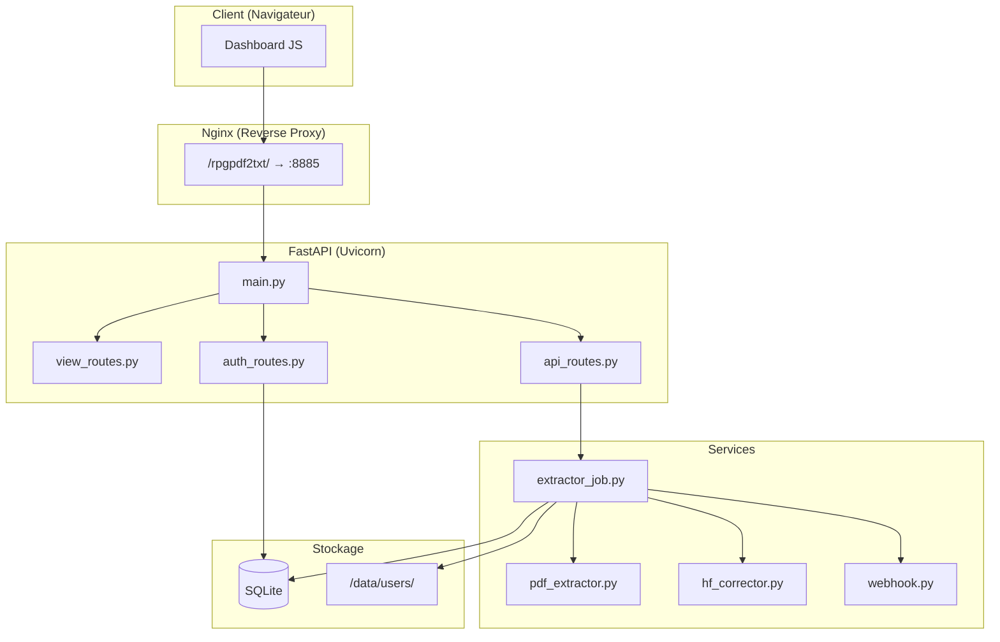

# Architecture de RPGPDF2Text

Ce document détaille l'architecture sous-jacente de RPGPDF2Text, ainsi que les choix techniques. L'application respecte les conventions définies dans `PROJECT_RULES.md`.

## Composition Technologique

| Composant | Technologie | Fichier(s) |
|---|---|---|
| Framework Web | FastAPI (Python 3.12+) | `app/main.py` |
| Gestionnaire de paquets | `uv` | `requirements.txt` |
| Frontend | Jinja2 + Bootstrap 5 + JS ES6+ | `app/templates/`, `app/static/js/` |
| Base de données | SQLite + SQLAlchemy ORM | `app/db/models.py`, `app/db/database.py` |
| Extraction PDF (natif) | PyMuPDF | `app/services/pdf_extractor.py` |
| Extraction PDF (OCR) | pdf2image + pytesseract | `app/services/pdf_extractor.py` |
| Correction IA | API HuggingFace (Meta-Llama-3-8B-Instruct) | `app/services/hf_corrector.py` |
| Authentification | JWT (python-jose) + bcrypt | `app/core/security.py`, `app/routes/deps.py` |
| Logging | Loguru → stdout + `data/logs/app.log` | `app/main.py` |
| Webhooks | httpx (async) | `app/services/webhook.py` |
| Déploiement | paramiko (SSH/SFTP) | `deploiement.py` |

## Architecture Applicative



## Structure du Dossier `app/`

### `/routes/` — Contrôleurs

| Fichier | Rôle | Routes principales |
|---|---|---|
| `view_routes.py` | Pages HTML (templates Jinja2) | `/`, `/login`, `/dashboard`, `/admin`, `/register` |
| `auth_routes.py` | API d'authentification JWT | `/api/v1/auth/login` |
| `api_routes.py` | API fonctionnelle | `/api/v1/extract`, `/api/v1/user/requests`, `/api/v1/admin/users` |
| `deps.py` | Dépendances d'injection (auth) | — |

### `/core/` — Configuration et sécurité

| Fichier | Rôle |
|---|---|
| `config.py` | Settings Pydantic, chargement de `deployment.yaml` et `.env` |
| `security.py` | Hashage bcrypt, création/vérification de tokens JWT |

### `/services/` — Logique métier

| Fichier | Rôle |
|---|---|
| `extractor_job.py` | Orchestrateur du pipeline d'extraction (tâche de fond) |
| `pdf_extractor.py` | Extraction de texte (PyMuPDF natif ou OCR) |
| `hf_corrector.py` | Correction IA via HuggingFace Inference API |
| `webhook.py` | Envoi de notifications (Discord, webhooks clients) |

### `/db/` — Base de données

| Fichier | Rôle |
|---|---|
| `database.py` | Initialisation de SQLAlchemy, session factory |
| `models.py` | Modèles : `User`, `SystemConfig`, `ExtractionRequest`, `ActivityLog` |

## Gestion du Préfixe d'URL

L'application supporte un déploiement derrière un reverse proxy avec un préfixe d'URL (ex: `/rpgpdf2txt`).

### Mécanisme

1. Le préfixe est défini dans `config/deployment.yaml` (`app_prefix`) et chargé via `APP_PREFIX` dans `config.py`
2. Dans `main.py`, toutes les routes sont montées sous ce préfixe :
   ```python
   app.include_router(view_routes.router, prefix=_prefix)
   app.include_router(api_routes.router, prefix=_prefix + "/api/v1")
   app.mount(f"{_prefix}/static", StaticFiles(...))
   ```
3. Les templates reçoivent `app_prefix` dans le contexte Jinja2
4. Le JavaScript lit le préfixe depuis une balise `<meta name="app-prefix">` dans `base.html`
5. Nginx transmet le chemin complet **sans le supprimer** (`proxy_pass` sans `/` final)

> **Important :** Ne **jamais** utiliser `root_path` dans le constructeur FastAPI ni `--root-path` dans uvicorn. Le préfixe est géré nativement par le montage des routes.

## Dossiers d'Exploitation (générés à l'exécution)

| Dossier | Contenu |
|---|---|
| `data/db/` | Base de données SQLite (`rpgpdf2text.db`) |
| `data/logs/` | Journaux de fonctionnement (rotation 10 Mo, rétention 10 jours) |
| `data/users/` | Répertoires physiques des utilisateurs (résultats d'extraction) |
| `data/temp/` | Fichiers PDF temporaires (nettoyés après traitement) |

## Procédure de Déploiement

Voir le guide complet : **[doc/DEPLOIEMENT.md](DEPLOIEMENT.md)**

### Résumé rapide

1. **Développement local** : `bash run_local.sh` → `http://localhost:8000`
2. **Production** : `python deploiement.py` → déploiement SSH automatique

### Variables d'Environnement (`.env`)

```env
SECRET_KEY=une_super_cle_secrete_longue
DATABASE_URL=sqlite:///./data/db/rpgpdf2text.db
APP_PREFIX=/rpgpdf2txt
```
